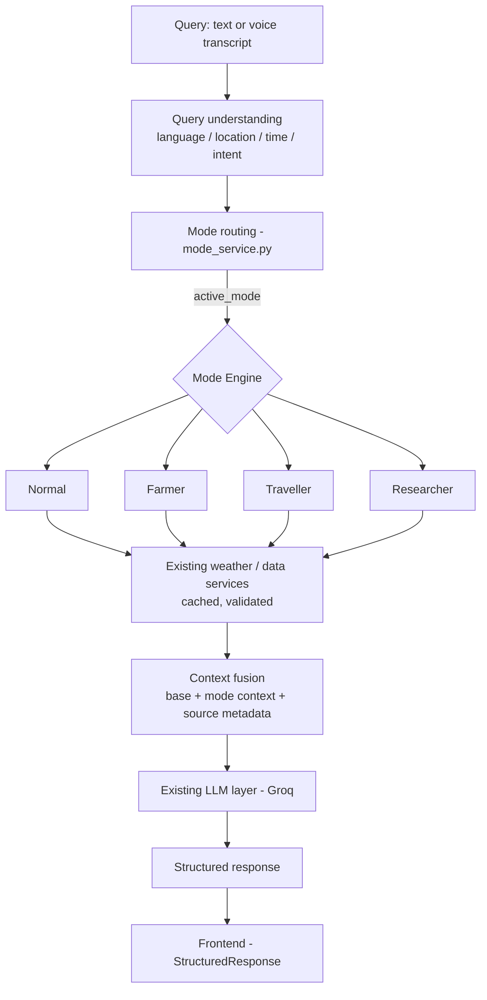

# 00 — Mode Engine Master Overview

> **Project:** WeatherGPT · **Branch:** `phase4-intelligent-modes` · **Set:** `docs/mode-intelligence/` (files `00`–`11`, i.e. 12 files)
> This is the single high-level reference. Files `01`–`11` expand individual parts. On conflict: this file defines intent, the specific file defines detail, **the repository defines current behavior.**

## 0. Status markers

| Marker | Meaning |
|---|---|
| **CURRENT** | Exists in the repository. |
| **TARGET** | Intended architecture; not implemented or not confirmed. |
| **FUTURE** | Optional / later phase. |
| **[VERIFY]** | Claim about the repo taken from the project brief, not yet confirmed in code. Confirm, then replace with a `file:symbol` reference (or correct the text). |

> Written without repository access: every CURRENT claim below is `[VERIFY]` until confirmed. Names marked conceptual must be replaced by the repo's real names.

---

## 1. What the Mode Engine is

A thin layer **inside the existing WeatherGPT pipeline**, placed after mode resolution and before LLM generation. For the resolved mode it selects extra data from existing services, applies domain rules, and returns **structured mode context** (data, insights, warnings, sources, uncertainty, fallback info) to the existing LLM.

It is **not**: a second LLM, four pipelines, a new mode detector, or a replacement for query understanding, weather/GIS/voice/auth services, or the frontend renderer.

## 2. Shared pipeline



- CURRENT `[VERIFY]`: query understanding, `mode_service.py`, weather/warning/Agromet/GFS/GIS services, LLM layer, `/chat`, `/voice/chat`, `StructuredResponse.tsx`.
- TARGET: the Mode Engine block, `engine.process()` call, and `ModeContext` handoff to the LLM. `[VERIFY]` exact insertion point in the current `/chat` flow.
- One request runs **one** engine (the active mode's). Voice and GIS use the same path; no separate architecture.

## 3. Routing vs. engine

| | Mode routing | Mode engine |
|---|---|---|
| Answers | Which mode is active? | What happens inside that mode? |
| Owner | `mode_service.py` (`ModeConfiguration`, `ModeResolution`; `selected_mode` / `active_mode` / `display_mode`) — CURRENT `[VERIFY]` field semantics | `mode_engines/` — TARGET |
| Output | Resolved mode | Structured mode context |

Rules: engines never re-decide the mode; the router never fetches domain data; **no second detection system** — improve routing in place if needed and record it in `02`. Keywords alone don't specialize: "wheat" in Normal triggers Farmer processing only if routing resolves Farmer.

## 4. Four modes

| Mode | Purpose | Engine adds |
|---|---|---|
| **Normal** | General weather; baseline/control | Nothing / minimal |
| **Farmer** | Weather impact on crops and farm operations | Crop context, IMD Agromet/GKMS, ICAR knowledge, agricultural rules |
| **Traveller** | Weather impact on trips | Rain/heat/cold/wind exposure, timing, packing, disruption context |
| **Researcher** | Analysis of data and models | Historical, climate averages, GFS/NWP, model comparison, statistics, uncertainty |

Examples: "Will it rain tomorrow?" → Normal · "Will rain affect my wheat crop tomorrow?" → Farmer · "Will rain affect my trip tomorrow?" → Traveller · "Compare tomorrow's forecast with historical rainfall." → Researcher · "Will rain affect my plans?" → ambiguous, stay Normal.

## 5. Normal Mode = baseline

Normal uses existing query understanding, location/time detection, weather context, and LLM path with no domain logic. **Existing normal behavior must not change** without a documented reason; the Normal regression suite is the gate for every engine change. Detail: `03`.

## 6. Specialized data-source isolation (TARGET)

| Source | Normal | Farmer | Traveller | Researcher |
|---|---|---|---|---|
| Current, forecast, hourly | Yes | Yes | Yes | Yes |
| IMD warnings | Existing capability | Yes | Yes | Yes |
| IMD Agromet (`agromet_service.py`) | **No automatic use** | **Yes** | No | No |
| ICAR knowledge | **No automatic use** | **Yes** | No | No |
| Agricultural rules | No | Yes | No | No |
| Travel processing | No | No | Yes | No |
| Historical / climate | When relevant (existing) | If relevant | If relevant | Yes |
| GFS / model comparison | When relevant (existing) | No | No | Yes |

- ICAR and Agromet are **Farmer-Engine dependencies, not global pipeline dependencies**; they are called only when Farmer is the active mode.
- Engines **call existing services** (`weather_service`, `warning_service`, `agromet_service`, `gfs_service`, etc. `[VERIFY]` names); they never add their own API clients.
- ICAR retrieval: TARGET unless found in the repo. `[VERIFY]`
- If `traveller_service.py` / `researcher_service.py` already hold mode logic, the engine wraps or absorbs them rather than duplicating.

## 7. Context fusion → LLM → response

```
BASE CONTEXT    query, language/script, location, time, current weather, forecast, hourly, basic warnings
+ MODE CONTEXT  from the active engine
+ SOURCE METADATA
+ USER REQUEST
        → existing LLM → structured response → frontend
```

- The backend gathers data first; the LLM does not call weather APIs.
- Engines return **structured context, not final prose**. The existing LLM writes the answer (CURRENT `[VERIFY]`: Groq `qwen/qwen3.8-27b`, max 800 completion tokens, `groq==1.7.0`).
- Conceptual `ModeContext` (reuse an existing structure if one exists `[VERIFY]`): `mode`, `intent`, `domain_data`, `insights`, `warnings`, `recommendations`, `sources`, `uncertainty`, `metadata`, `fallback`. Schema detail: `01`, `10`.
- Conceptual interface (adapt to the code):

```python
resolution = resolve_mode(request)                         # existing
engine = get_mode_engine(resolution.active_mode)           # new registry
mode_context = await engine.process(request=request, base_context=base_context)
response = await generate_response(request=request, base_context=base_context, mode_context=mode_context)
```

## 8. Response depth

Depth is **not** set by mode alone:

```
MODE + USER INTENT + QUESTION COMPLEXITY + AVAILABLE RELEVANT DATA → processing depth → response detail
```

Farmer/Traveller/Researcher + "What is the temperature?" → concise. Farmer + "Should I sow wheat tomorrow given rainfall and IMD advisory?" → detailed. Normal + "Why will tomorrow be hotter?" → explanatory. `[VERIFY]` whether any depth signal exists today; otherwise TARGET (engine supplies a depth hint in mode context). Detail: `08`.

## 9. Source attribution

| Level | Kind | Rule |
|---|---|---|
| 1 | Official direct (IMD warnings, IMD Agromet/GKMS) | Labelled official **only if actually retrieved** from the official source |
| 2 | Provider data (Open-Meteo) | Attributed to provider |
| 3 | Model guidance (GFS/NWP) | Labelled guidance, not certainty |
| 4 | Derived calculation | Labelled as calculated |
| 5 | AI interpretation / generic context | Never labelled official |

Never write "IMD recommends…" or "ICAR recommends…" unless that data was retrieved. Keep observation vs. forecast and raw vs. calculated distinct. Regional-language official text is preserved. Detail: `07`.

## 10. Boundaries

- **Explicit selection:** a user-selected specialized mode stays active, subject to existing boundary logic. **Automatic routing:** only from Normal, only on clear signals, conservative.
- **Mismatch** (e.g. Traveller selected, farming question): do not blindly answer as the selected mode. `[VERIFY]` exact behavior in `test_mode_boundaries_e2e.py` (Traveller → Farmer, Gujlish mismatch) and document it in `09`.
- Traveller stays weather-based: **no road, rail, flight, or traffic claims** without a verified source.
- Respect existing location/time parsing. Temporal-only phrases ("tomorrow", "next three hours", "what is the weather today") are never locations; do not reintroduce the `travel to Delhi` parsing bug.
- No engine may require English input.

## 11. Fallback

An optional-source failure downgrades the answer; it never fails the chat.

| Failure | Behavior |
|---|---|
| Agromet unavailable (Farmer) | Use weather data; state official advisory unavailable; no invented advisory |
| GFS / comparison unavailable (Researcher) | Use historical/forecast; name the missing source; do not imply a comparison happened |
| Traveller processing fails | Return normal weather answer |
| Warning service unavailable | State warning status could not be confirmed; do not imply "no warnings" |
| Engine raises | Fall back to Normal-style context; record in `ModeContext.fallback` |

Detail: `09`.

## 12. Security

Validate `selected_mode` against the allowed set; validate locations/parameters; **no global active-mode state and no shared mutable per-user state in engines** (no cross-session leakage); preserve auth (guest chat still works), CORS, safe DB errors; no secrets in the frontend; reuse existing caching and avoid unnecessary external calls; engines cannot bypass existing validation.

## 13. Testing (detail in `11`)

Mandatory: **Normal regression**. Also: routing per mode, explicit vs automatic selection, ambiguity, wrong-domain, multilingual/Gujlish/Hinglish, location + time interaction, source failure and fallback, attribution, session isolation, response depth, frontend/backend contract. Existing suites to keep green `[VERIFY]`: `test_agromet_service.py`, `test_daily_outlook_e2e.py`, `test_live_e2e.py`, `test_mode_boundaries_e2e.py`, `test_multilingual_gujlish.py`, `test_production_security.py`, `test_sprint22.py`.

## 14. Current vs. target

| Area | Status |
|---|---|
| `/chat`, weather/GIS/voice/auth endpoints, caching | CURRENT `[VERIFY]` |
| `mode_service.py` routing, boundaries, session-level context, mode-specific prompts | CURRENT `[VERIFY]` |
| `agromet_service.py` | CURRENT `[VERIFY]` |
| `StructuredResponse` (farmer insights, Agromet advisories, travel status, packing, warnings) | CURRENT `[VERIFY]` |
| `mode_engines/` package, `BaseModeEngine`, engine registry | TARGET |
| Structured `ModeContext` | TARGET unless equivalent exists |
| ICAR retrieval, agricultural rules | TARGET unless found |
| Response-depth control | TARGET unless found |

## 15. Implementation approach

Inspect first → base interface + `ModeContext` + registry → Normal Engine with zero-regression proof → wire into chat flow → Farmer → Traveller → Researcher → contract adjustments → full boundary/multilingual/failure/security tests. One engine per vertical slice, tests after each. Consider a bypass flag for the engine layer. Plan: `11`.

## 16. Verification checklist

- [ ] `mode_service.py`: real fields of `ModeConfiguration`/`ModeResolution`; how the three mode fields are set
- [ ] Where mode resolution is called in `/chat`; current shape of the base context
- [ ] Response/request schemas and `frontend/src/api/types.ts`
- [ ] Whether `traveller_service.py` / `researcher_service.py` exist and what they do
- [ ] `agromet_service.py` public functions, return shape, failure behavior; any ICAR code
- [ ] Warning, GFS, model-comparison, historical, climate service entry points
- [ ] LLM entry point, per-mode prompt/persona construction, model/token config
- [ ] Boundary and multilingual test assertions
- [ ] Session/context storage (isolation) and caching opt-in
- [ ] Anything above that contradicts the repo → record and follow the repo

## 17. Document map

`01` architecture · `02` routing · `03` Normal · `04` Farmer · `05` Traveller · `06` Researcher · `07` data sources and context · `08` reasoning and response · `09` boundaries and fallback · `10` API/frontend contract · `11` testing and implementation.