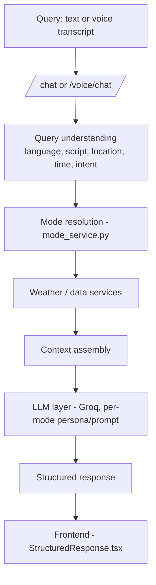
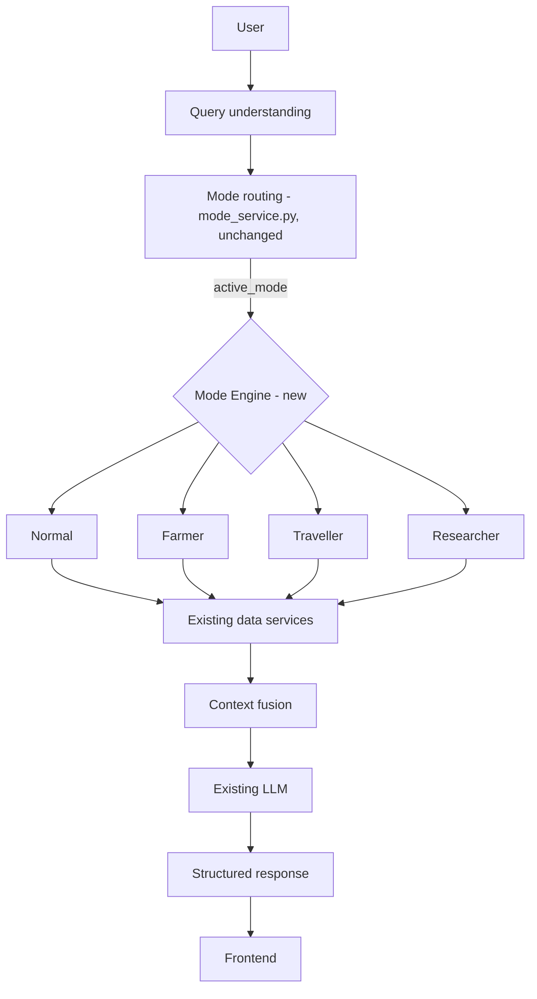
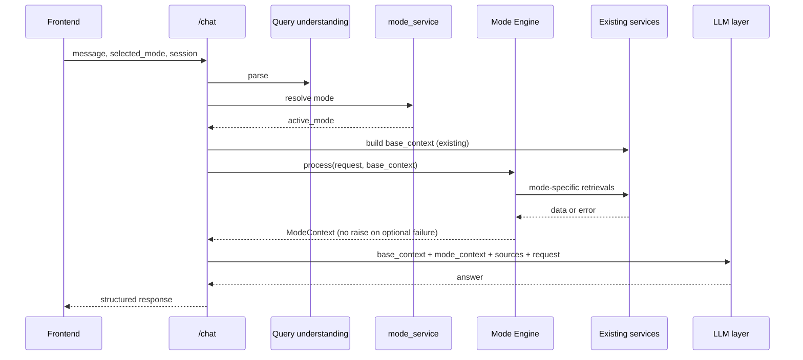

# 01 — Mode Engine Architecture

> **Set:** `docs/mode-intelligence/` · **Depends on:** `00_MODE_ENGINE_MASTER.md`
> **Scope:** where the Mode Engine sits, its components and interfaces, dependency rules, and integration with services, LLM and frontend. Routing algorithm → `02`; per-engine behavior → `03`–`06`; sources → `07`; reasoning → `08`; fallback → `09`; wire contract → `10`; tests → `11`.

## 0. Status markers

| Marker | Meaning |
|---|---|
| **CURRENT** | Exists in the repository. |
| **TARGET** | Intended design; not implemented or not confirmed. |
| **FUTURE** | Optional, later. |
| **[VERIFY]** | Taken from the project brief, not yet confirmed in code. Confirm, replace with a `file:symbol` reference, or correct. |

> Written without repository access. Every CURRENT statement is *reported*, not *observed*. Code and class names in sketches are conceptual and must be replaced by the repo's real names. **The repository wins on any conflict**; record differences in Section 15.

---

## 1. Current request flow (CURRENT, `[VERIFY]`)



Reported facts: FastAPI (`backend/app/main.py`); `mode_service.py` provides `ModeConfiguration`/`ModeResolution` and handles `selected_mode`, `active_mode`, `display_mode`, auto-routing from Normal, manual specialized selection and boundaries; specialization today is "same LLM with specialized prompts/personas" plus session-level context; the frontend already renders farmer insights, IMD warnings, Agromet advisories, travel status and packing advice.

**Unknowns that decide the integration point** (inspect first):
1. The function that assembles LLM context (name, module, signature) and the shape of the base context.
2. Whether mode-specific fetching happens before the LLM call, inside prompt-building code, or in separate services (`traveller_service.py`, `researcher_service.py`).
3. Whether a structured mode-context object already exists.
4. **Whether the current Normal path already calls Agromet/GFS/history.** If it does, that is a CURRENT-vs-TARGET difference: record it in Section 15; changing it is a behavior change, not a refactor.

## 2. Target flow (TARGET)



- The engine runs **after mode resolution, before LLM generation**, **once per request**, for the **active mode only**.
- It is invoked inside the existing chat flow. No new public endpoint. `[VERIFY]`
- One shared pipeline; engines are not pipelines.

| Stage | Current (reported) | Target |
|---|---|---|
| Understanding, mode resolution | Existing | Unchanged (improve in place only if required, and record it in `02`) |
| Mode-specific data | Location unclear `[VERIFY]` | Mode Engine |
| Base data | Existing services | Unchanged |
| Context assembly | Existing | `base_context` + `mode_context` |
| LLM | Existing, persona per mode | Same model; receives `mode_context` as extra structured input |
| Response | Existing structured response | Additive optional fields only |

---

## 3. Components

| Component | Status | Responsibility |
|---|---|---|
| Query understanding | CURRENT | Language, script, location, time, intent. Unchanged. |
| `mode_service.py` | CURRENT | Selection, resolution, boundaries. |
| Engine registry | TARGET | Maps mode identifier → engine instance. |
| `BaseModeEngine` | TARGET | Shared interface and error-containment wrapper. |
| `NormalEngine` / `FarmerEngine` / `TravellerEngine` / `ResearcherEngine` | TARGET | See Section 6. |
| `ModeContext`, `SourceRecord` | TARGET (reuse an equivalent if found `[VERIFY]`) | Structured, attributed engine output. |
| Data services | CURRENT | Reused unchanged. |
| Context fusion | CURRENT in part `[VERIFY]` | Merges base context, mode context, source metadata, request. |
| LLM layer, response builder, frontend | CURRENT | Unchanged. |

Target layout (adapt to the repo; reuse any existing equivalents):

```
backend/app/services/
├── mode_service.py           # CURRENT: routing
├── mode_engines/             # TARGET
│   ├── __init__.py           # registry: get_mode_engine()
│   ├── base_engine.py        # BaseModeEngine, ModeContext, SourceRecord
│   ├── normal_engine.py
│   ├── farmer_engine.py
│   ├── traveller_engine.py
│   └── researcher_engine.py
└── weather / warning / agromet / gfs / researcher / traveller / llm services   # CURRENT [VERIFY names]
```

---

## 4. Router responsibilities (CURRENT, `[VERIFY]`)

The router answers **"which mode is active?"**: validates `selected_mode`, applies explicit-selection rules, performs conservative auto-routing from Normal, enforces boundaries, and returns `ModeResolution` (`active_mode`, plus `selected_mode`/`display_mode` semantics per the code). It does not fetch domain data and does not import engines. Engines never re-decide the mode. **There is one routing system**; do not add a second detector. Detail: `02`.

## 5. Engine selection and registry (TARGET)

```python
_ENGINES = {"normal": NormalEngine(), "farmer": FarmerEngine(),
            "traveller": TravellerEngine(), "researcher": ResearcherEngine()}

def get_mode_engine(active_mode: str) -> BaseModeEngine:
    return _ENGINES.get(active_mode, _ENGINES["normal"])   # unknown/invalid -> Normal, never raises
```

Keys are the validated mode identifiers already used by `mode_service.py` `[VERIFY exact values]`, not new strings. Static, explicit registration (dynamic discovery is FUTURE).

## 6. Base engine and engine responsibilities

### 6.1 `BaseModeEngine` (TARGET, conceptual)

```python
class BaseModeEngine:
    mode: str
    async def process(self, request, base_context) -> "ModeContext":
        """Single containment boundary. Never raises for optional-source failure."""
        ctx = ModeContext.empty(self.mode)
        try:
            plan     = await self.plan(request, base_context)            # 1 define required context
            selected = await self.select_sources(plan, request, base_context)  # 2 choose extra sources
            fetched  = await self.retrieve(selected, request, base_context)    # 3 call existing services
            combined = await self.combine(fetched, base_context)         # 4 merge
            ctx      = await self.reason(combined, request, base_context, ctx) # 5 domain rules -> insights
        except OptionalSourceError as e: ctx.add_fallback(e)             # recorded, not raised
        except Exception as e:           ctx = ModeContext.fallback_from(self.mode, e)  # log; chat continues
        return ctx
```

Inputs `request` (normalized output of query understanding + mode resolution) and `base_context` are **read-only**. Steps default to no-ops so Normal inherits them. Independent retrievals run concurrently.

### 6.2 Engine responsibilities

| Engine | Adds to context | Calls (existing services) | Never |
|---|---|---|---|
| **Normal** | Nothing / minimal | None beyond base | Farmer/Traveller/Researcher logic; automatic Agromet/ICAR |
| **Farmer** | Crop context, Agromet/GKMS advisories, ICAR knowledge `[TARGET unless found]`, agricultural rules `[TARGET]`, weather-derived farm insights | `agromet_service`, weather, warnings (+ history if relevant) | Invent an advisory; label derived text as official; re-implement crop matching/validation |
| **Traveller** | Rain/heat/cold/wind exposure, timing windows, packing context, disruption awareness | Weather (hourly), warnings; wraps/absorbs `traveller_service` if present | Claim road/rail/flight/traffic status without a verified source |
| **Researcher** | Historical, climate averages, GFS/NWP, model comparison, statistics, uncertainty | GFS/model, historical/climate, weather; wraps/absorbs `researcher_service` if present | Present model output as certainty; mix observations with forecasts |

---

## 7. Context: base vs. mode, and fusion

| Layer | Produced by | Contents |
|---|---|---|
| Request | Query understanding + mode service | Query, language/script, location, time, intent, modes |
| **Base context** | Existing pipeline | Current weather, forecast, hourly, basic warnings, location/time metadata |
| **Mode context** | Engine | `domain_data`, `insights`, `warnings`, `recommendations`, `sources`, `uncertainty`, `metadata`, `fallback` |
| Source metadata | Services + engine | Provenance per item |

Conceptual `ModeContext` fields: `mode`, `intent`, `domain_data`, `insights` (labelled derived), `warnings` (labelled official/derived), `recommendations` (only where supportable, labelled by origin), `sources` (`SourceRecord`: `name`, `kind` official/provider/model/derived/ai, `official`, `retrieved_at`, `detail`), `uncertainty`, `metadata` (version, timings, sources attempted/failed), `fallback`. Structured, attributed, JSON-serializable; **never final prose**. Attribution levels: `00` §9, `07`.

Ownership: base context belongs to the existing pipeline (engines don't modify it); mode context to the engine; **fusion to the response layer** (engines don't build prompts). Before calling a service, an engine checks whether `base_context` already holds the data, so hourly/forecast are not fetched twice; existing caching applies `[VERIFY opt-in mechanism]`.



---

## 8. Service reuse and source boundaries

| Service (reported `[VERIFY]`) | Normal | Farmer | Traveller | Researcher |
|---|:-:|:-:|:-:|:-:|
| Weather (current/forecast/hourly), location, GIS | base | base + extra | base + extra | base + extra |
| Official warnings | base | ✔ | ✔ | ✔ |
| `agromet_service` (IMD Agromet/GKMS) | ✘ | ✔ | ✘ | ✘ |
| ICAR knowledge | ✘ | ✔ `[TARGET]` | ✘ | ✘ |
| Historical / climate | when relevant (existing) | optional | optional | ✔ |
| GFS / model comparison | when relevant (existing) | ✘ | ✘ | ✔ |

Rules:
1. **Call, never clone.** No new HTTP/API clients under `mode_engines/`. Missing capability → add to the appropriate *service* (order: use existing → extend existing → add new service function with caching/timeouts consistent with peers).
2. **ICAR and IMD Agromet are Farmer-Engine dependencies, not global.** They execute only when the active mode is Farmer. The base context, Normal, Traveller and Researcher paths must not call them. A farming keyword in Normal does not trigger them; only routing resolving to Farmer does.
3. `agromet_service` already owns crop normalization/matching, state IDs, validity filtering, regional-language preservation and India-only validation; the engine consumes its result.
4. If `traveller_service.py` / `researcher_service.py` hold mode logic, the engine wraps them or absorbs the logic and reduces the old module to a delegate. Never leave two implementations.

---

## 9. Response depth (TARGET; `[VERIFY]` any current equivalent)

Depth is **not** set by mode alone:

```
MODE + USER INTENT + QUESTION COMPLEXITY + AVAILABLE RELEVANT DATA → processing depth → response detail
```

- The engine sets **processing depth**: a simple query ("What is the temperature?") in any mode skips extra retrieval; a complex one ("Should I sow wheat tomorrow given rainfall and IMD advisory?") triggers the full mode plan.
- The engine can expose a compact depth hint in `metadata`; the prompt/response layer uses it for **response detail** (`08`). Complexity and intent come from existing query understanding; do not add a second classifier without documenting it.
- No mode implies "always long" or "always short".

## 10. LLM integration

- Same existing LLM layer/model; no second LLM `[VERIFY: Groq model, max completion tokens 800, `groq==1.7.0`]`. Engine owns *what data and rules*; LLM owns *the natural-language answer in the user's language*.
- Handoff (conceptual): `generate_response(request, base_context, mode_context)`. `mode_context` is serialized as a compact, labelled block separate from base data and the user's query (layout in `08`).
- **Token budget:** the completion limit is small; engines/fusion prioritize and truncate deterministically, not the LLM. `[VERIFY prompt headroom]`
- Existing per-mode personas are reviewed and kept/merged, not duplicated. The LLM does not call data APIs. Language/script metadata is passed through; never force English.
- Prompt and response builder must not label AI text as official.

---

## 11. Error handling and fallback

`BaseModeEngine.process()` is the single containment boundary. An optional-source failure downgrades the answer; it never fails the chat.

| Failure | Behavior |
|---|---|
| Agromet unavailable (Farmer) | Continue with weather; record in `fallback`; state official advisory unavailable; no invented advisory |
| GFS/comparison unavailable (Researcher) | Use historical/forecast; name the missing source; don't imply a comparison |
| Traveller processing fails | Return basic weather answer |
| Warning service unavailable | State warning status couldn't be confirmed; don't imply "no warnings" |
| Engine raises unexpectedly | Fallback `ModeContext` (Normal-style), log, chat continues |
| Base context missing | Minimal context; existing pipeline error handling applies |

Optional retrievals use each service's existing timeout conventions (e.g. `IMD_AGROMET_TIMEOUT_SECONDS` `[VERIFY]`); never wait unboundedly. Optional single flag to bypass the engine layer for first release (FUTURE, decide in `11`). Log mode, engine version, sources attempted/failed, duration via existing logging conventions; never log secrets. Detail: `09`.

---

## 12. API / frontend contract considerations

- Frontend not redesigned. Engine output maps onto existing `StructuredResponse` concepts: metrics/location-time (base), official warnings (warning service), farmer insights and Agromet advisories (Farmer), travel status and packing advice (Traveller), cards/visuals (existing builders). `[VERIFY]` against `frontend/src/api/types.ts` and backend schemas.
- **Additive only:** new fields are optional; existing fields keep their meaning; anything not yet implemented is labelled PROPOSED in `10` until it exists.
- Mode-state exchange is unchanged: frontend sends `selected_mode`; backend returns resolved `active_mode`/`display_mode` `[VERIFY]`. Backend, not frontend, holds mode intelligence.
- `WeatherVisual` logic is never duplicated on the backend; `SuggestedPrompts` keeps using mode/location/language/script/context.

## 13. Dependency direction, security and session isolation

| From | May depend on | Must NOT depend on |
|---|---|---|
| `mode_engines/*` | Data services, shared schemas, `base_engine` | Other engines, routes, LLM layer, frontend, auth internals |
| Data services | External APIs, cache, config | `mode_engines`, `mode_service` |
| `mode_service` | Query-understanding output, config | `mode_engines` |
| LLM layer | `ModeContext` schema as input | Engine internals; new data fetching |
| Routes | Orchestration | Engines directly |

Security: validate `selected_mode` against the allowed set (unknown → Normal); validate locations/parameters (engines never bypass existing validation); no secrets in frontend; preserve auth (guests keep core experience), CORS and safe DB errors; avoid unnecessary external calls.

Isolation: engines are **stateless singletons**; **no global active-mode state**; no per-user data on engine objects, module globals or unscoped caches. Session-specific values (remembered crop, prior location) are read from existing session context by orchestration and passed in. Engine caches key on non-personal parameters (location, date range, product) unless the existing cache is already safely scoped. No shared mutable state across concurrent requests. `[VERIFY session storage and scoping]`

---

## 14. Testing requirements (detail in `11`)

| Area | Must show |
|---|---|
| **Normal regression (gate)** | Normal outputs unchanged; no Agromet/ICAR/GFS calls from Normal path |
| Routing/selection | Registry returns the right engine; invalid mode → Normal; explicit vs auto-routing unchanged |
| Isolation of sources | Agromet/ICAR called only when active mode is Farmer (assert on mocks) |
| Boundaries | Existing `test_mode_boundaries_e2e.py` cases still pass; mismatch cases documented |
| Fallback | Each optional-source failure yields degraded answer, not error; no fabricated advisory |
| Attribution | Official label only for retrieved official data |
| Multilingual | Gujlish/Hinglish/Unicode queries route and answer without English assumption |
| Location/time | Temporal-only phrases never become locations |
| Depth | Simple vs complex queries produce different processing depth in the same mode |
| Security/isolation | Two sessions with different modes don't leak; invalid mode rejected safely |
| Contract | Response fields match `types.ts`; new fields optional |

## 15. Current vs. target, and mismatch log

| Area | Status |
|---|---|
| `/chat`, `/voice/chat`, weather/warning/Agromet/GFS/history/GIS services, caching, LLM layer, `StructuredResponse` | CURRENT `[VERIFY]` |
| `mode_service.py` routing, boundaries, persona-per-mode | CURRENT `[VERIFY]` |
| `mode_engines/`, `BaseModeEngine`, registry, `ModeContext`/`SourceRecord` | TARGET |
| ICAR retrieval, agricultural rules | TARGET unless found |
| Depth hint in `metadata` | TARGET unless found |
| Engine bypass flag, dynamic engine discovery, extra suggested-prompt hints | FUTURE |

Refactor-vs-add classification (do first): mode logic inside prompt-building code → extract into `retrieve`/`reason`, prompt builder consumes `ModeContext`; logic in `traveller_service`/`researcher_service` → engine wraps it; nowhere → new engine logic over existing services. For Normal, usually nothing to extract. Any branch must preserve existing outputs until a documented enhancement.

| # | Item | Document said | Repository has | Action |
|---|---|---|---|---|
| 1 | | | | |

**Verification checklist:** chat route, orchestration, context-assembly and LLM entry point names; real `ModeConfiguration`/`ModeResolution`; base-context shape and any existing mode-context object; where per-mode prompts live; existence/content of `traveller_service.py`/`researcher_service.py`; service signatures (weather, warning, Agromet, GFS, history, climate); response schemas and `types.ts`; caching opt-in; session-context scoping; timeout/logging conventions; whether Normal already calls specialized sources; existing mode tests' assertions.

**Fifth mode (FUTURE):** add identifier in `mode_service.py`, engine file, registry entry, persona, frontend label, tests. If other engines or the pipeline must change, the design has leaked.