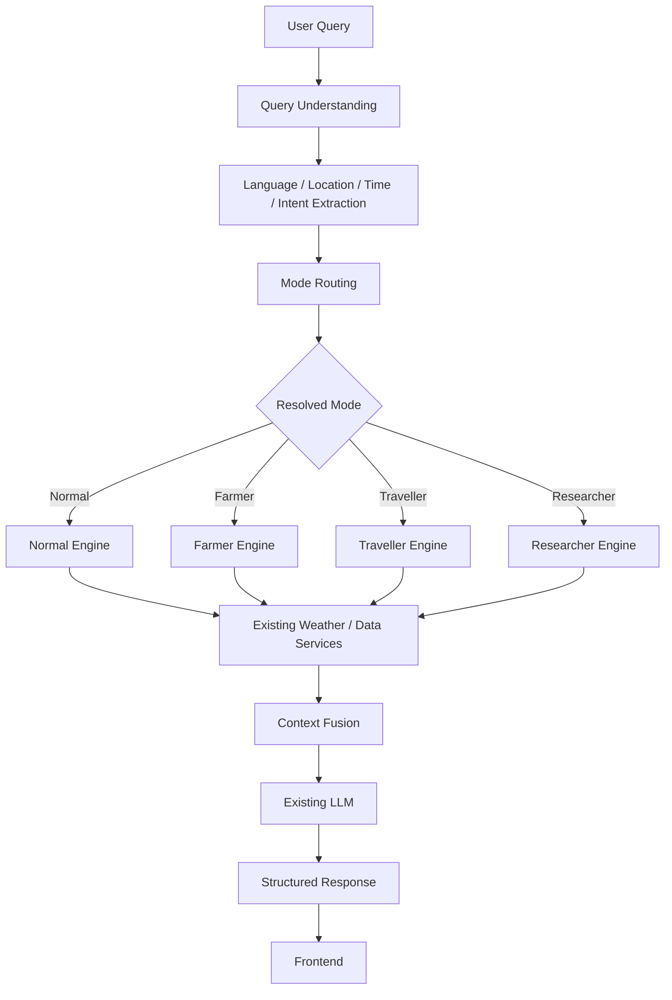
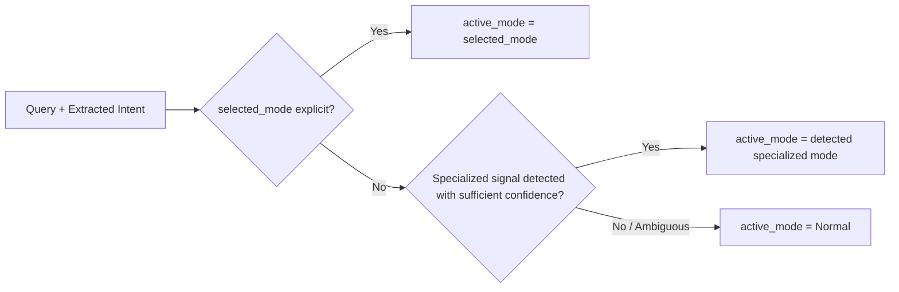
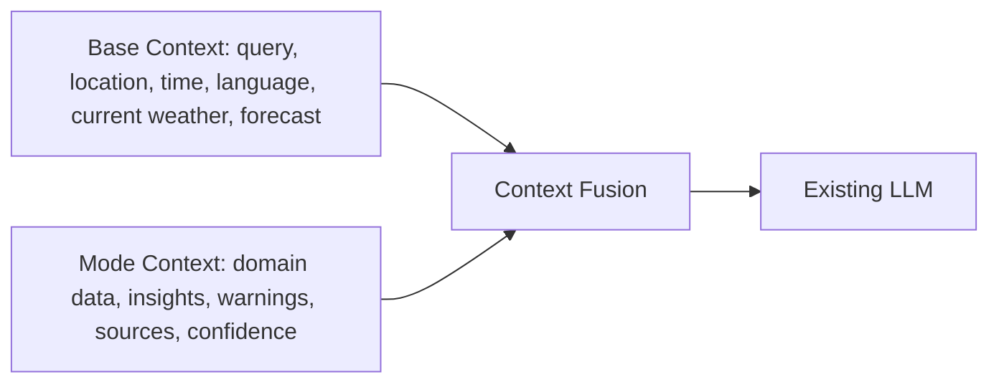

# 02 — Mode Routing

## Status Note (Read First)

This document was generated **without direct inspection of the WeatherGPT
repository** (`backend/app/services/mode_service.py`, the chat pipeline,
query-understanding modules, frontend mode state, and the existing mode
test suite were not accessible in the environment this document was
authored in).

As a result, everything below should be treated as **TARGET
ARCHITECTURE / PROPOSED BEHAVIOR** unless and until it is reconciled
against the real source. Nothing here should be read as a claim about
what `mode_service.py` currently does. Before this document is treated
as authoritative:

1. Open `backend/app/services/mode_service.py` and confirm whether
   `selected_mode`, `active_mode`, and `display_mode` exist, and what
   they actually mean.
2. Confirm whether automatic routing (Normal → Farmer/Traveller/Researcher
   based on query content) is implemented, partially implemented, or not
   yet implemented.
3. Confirm which of the "Farmer / Traveller / Researcher routing signals"
   below actually exist in code vs. are proposed here for the first time.
4. Walk each section below and re-tag it `CURRENT IMPLEMENTATION` where
   verified, or leave it `PROPOSED` where not.

Every section below carries an explicit status tag:
**`[CURRENT]`**, **`[TARGET]`**, or **`[PROPOSED]`**. Until step 1–4
above happens, treat every `[CURRENT]` tag in this draft as provisional
— it reflects what the architecture brief asserts, not verified code.

---

## 1. Overview

`[TARGET]`

Mode Routing is the decision layer that determines which of WeatherGPT's
four modes — **Normal**, **Farmer**, **Traveller**, **Researcher** — is
responsible for handling a given user request. It sits between query
understanding (language, location, time, intent extraction) and the Mode
Engine (the layer that performs mode-specific processing).

Mode Routing is deliberately a thin, single decision point. It does not
fetch weather data, does not call domain-specific services (Agromet,
GFS, warnings), and does not generate the final response. Its only job
is to answer one question per request:

> **"Which mode should process this request?"**

---

## 2. Purpose

`[TARGET]`

Mode Routing exists to let one shared WeatherGPT pipeline serve four
different domains of intent without becoming four separate
applications. It gives the system a single, inspectable place where the
"which mode" decision is made, rather than scattering that logic across
services, prompts, or the frontend.

Without a dedicated routing layer, mode-specific behavior (Agromet
calls, GFS calls, travel-specific framing) would risk being triggered
by ad-hoc keyword checks spread throughout the codebase — which is
exactly the failure mode this architecture is designed to avoid (see
§16, Mode-Specific Data Activation).

---

## 3. Routing Architecture

`[TARGET]`



Mode Routing is a **single stage** in this pipeline. It consumes the
output of query understanding (not raw text) and produces a resolved
mode plus routing metadata (confidence, matched signals, and whether the
resolution was explicit or automatic). It does not itself branch the
pipeline into separate code paths beyond selecting which Mode Engine
runs next.

---

## 4. Existing Mode System

`[NEEDS VERIFICATION]`

The architecture brief states that `backend/app/services/mode_service.py`
already contains `ModeConfiguration` and `ModeResolution` concepts, and
that routing signals for Farmer, Traveller, Researcher, and Normal
already exist. **This document cannot confirm the exact current
contents of that file.**

Action item for whoever implements/finalizes this doc: replace this
section with the actual current contents of `mode_service.py` — class
names, function signatures, and what routing logic (if any) is already
wired into the `/chat` endpoint.

---

## 5. `selected_mode` / `active_mode` / `display_mode`

`[PROPOSED — pending verification against mode_service.py]`

A useful three-way distinction for mode state:

| Concept | Meaning |
|---|---|
| `selected_mode` | The mode the user explicitly chose in the UI (or `None`/`auto` if they haven't chosen one). |
| `active_mode` | The mode actually used to process the *current* request, after routing has run. |
| `display_mode` | The mode the frontend shows as "active" to the user, which should normally equal `active_mode` unless there's a documented reason for divergence. |

**This three-way split is a proposed model, not a confirmed
implementation detail.** If `mode_service.py` uses different names, a
two-state model, or no explicit state machine at all, this section must
be rewritten to match reality rather than the other way around.

---

## 6. Explicit Mode Selection

`[TARGET]`

When a user explicitly selects a specialized mode (e.g., taps "Farmer"
in the UI):

- `selected_mode` is set to `Farmer`.
- `active_mode` becomes `Farmer` for subsequent requests in that
  session, **regardless of whether the individual query contains
  farming-specific language.**
- The Farmer Engine still receives the query as-is. If the query is a
  plain weather question ("what's the weather tomorrow?"), the Farmer
  Engine should not force-attach agricultural content the user didn't
  ask for — see §17, Response Depth.

Explicit selection establishes **domain context**, not **response
verbosity**. The two are governed independently (§17).

---

## 7. Automatic Mode Routing

`[TARGET]`

When no mode is explicitly selected (`selected_mode` is `Normal`/`auto`),
routing may promote the request to a specialized mode based on detected
intent signals from the query.



Automatic routing must be **conservative**: it should require clear
domain evidence (see §9–11 for per-mode signals) before leaving Normal
Mode. A single loosely-related keyword should not be sufficient — this
is elaborated in §12 (Ambiguous Queries) and §16 (Mode-Specific Data
Activation).

---

## 8. Normal Mode

`[TARGET]`

Normal Mode is the default and the baseline/control path.

- Handles general weather questions: current conditions, forecast,
  temperature, wind, rain likelihood, multi-day outlook.
- Uses only the existing weather pipeline — no Agromet, no GFS/model
  comparison, no travel-specific processing.
- Response is concise by default: a direct answer plus the essential
  supporting numbers, without unsolicited domain framing.

Normal Mode must remain stable as the Mode Engine is introduced. Any
regression in Normal Mode behavior (location handling, time handling,
multilingual support, response quality) is treated as a defect in the
Mode Engine work, not an acceptable side effect.

---

## 9. Farmer Mode Routing

`[TARGET]`

**Candidate signals** (proposed — verify against actual routing logic
if a classifier already exists):

- crop names / crop-related nouns
- farming, agriculture, field, sowing, irrigation, harvesting
- pesticide/fertilizer context
- explicit requests for "agricultural advisory"

**Example queries:**

- "Should I sow wheat tomorrow?"
- "Will rain damage my cotton crop?"
- "When should I irrigate my field?"
- "Give me agricultural advisory."

Routing to Farmer should combine intent signals with explicit selection
and session context, not rely on a single keyword match. If the
project already has a routing/classification mechanism (rule-based,
scored, or model-based), this section should describe *that* mechanism
specifically rather than presenting a new one.

---

## 10. Traveller Mode Routing

`[TARGET]`

**Candidate signals** (proposed):

- travel, trip, journey, destination, tourist, vacation
- packing, "what should I carry"
- outdoor activity or event planning tied to a location/date
- explicit "is it a good time to travel to X"

**Example queries:**

- "Should I travel to Delhi tomorrow?"
- "What should I pack for Manali?"
- "Will rain affect my trip?"

A known historical failure mode (per the architecture brief) was
misparsing "travel to Delhi" as a literal location string rather than
extracting "Delhi" as the destination. Mode Routing must not reintroduce
this bug: location/time extraction happens in query understanding
*before* routing, and routing must consume its output rather than
re-parsing raw text itself.

---

## 11. Researcher Mode Routing

`[TARGET]`

**Candidate signals** (proposed):

- explicit model names: GFS, NWP, ECMWF
- "compare", "trend", "historical", "analyze"
- requests for statistical summaries or model comparison
- explicit references to "last N years/days" of data

**Example queries:**

- "Compare GFS and ECMWF."
- "Show rainfall over the last 10 years."
- "Analyze the temperature trend."

A previously fixed bug: "what is forecast for next three hours" must
not be misread as a location. As with Traveller Mode, Researcher routing
must rely on query understanding's temporal extraction rather than
independently reinterpreting time phrases.

---

## 12. Ambiguous Queries

`[TARGET]`

Example: *"Will rain affect my plans tomorrow?"* — could plausibly be
Traveller intent or a general weather question.

**Rule:** if routing confidence is insufficient to clearly justify a
specialized mode, the request **stays in Normal Mode**. The system
should prefer predictable, Normal-Mode-by-default behavior over
aggressive specialized routing. This applies both to automatic routing
and to any confidence/threshold logic used internally — ambiguity
resolves toward Normal, never toward a guessed specialized mode.

---

## 13. Mode Boundaries

`[TARGET]`

| Mode | Domain |
|---|---|
| Normal | General weather |
| Farmer | Agriculture + weather |
| Traveller | Travel + weather |
| Researcher | Scientific/data analysis + weather |

Boundaries overlap in language but not in required evidence:

- "Will it rain tomorrow?" → Normal
- "Will rain affect my wheat crop?" → Farmer
- "Will rain affect my trip?" → Traveller
- "Compare tomorrow's forecast with historical rainfall." → Researcher

If a user has explicitly selected one specialized mode (e.g. Traveller)
and asks a question clearly belonging to another domain (e.g. a farming
question), routing should not silently reinterpret everything through
the Traveller lens — this boundary behavior should be governed by
whatever mismatch/transition logic already exists (see the project's
"Traveller → Farmer mismatch" tests referenced in §23) and documented
precisely once verified.

---

## 14. Multilingual Routing

`[TARGET]`

Mode routing must operate on the *output* of language detection and
query understanding, not require English input. Domain intent should be
detectable across:

- English
- Gujlish / Roman Gujarati ("kale varsad padse? mare ghau vavvana che")
- Hindi/Hinglish ("kal barish hogi? mujhe gehun bona hai")
- Gujarati Unicode ("કાલે વરસાદ પડશે? મારે ઘઉં વાવવાના છે.")
- the other supported languages/scripts (Hindi, Bengali, Tamil, Telugu,
  Kannada, Malayalam, Punjabi, Odia, Marathi)

This document cannot confirm which of these are actually exercised by
routing today vs. only by response generation — that should be verified
against `test_multilingual_gujlish.py` and related tests.

---

## 15. Location and Time Interaction

`[TARGET]`

Mode routing happens after (or alongside) location/time/intent
extraction — it must never corrupt those extractions. Specifically:

- "travel to Delhi" → location extraction must still correctly isolate
  "Delhi" as the destination even though "travel" is also a Traveller
  routing signal.
- "next three hours" → must remain a temporal expression, not be
  reinterpreted as a location, regardless of which mode is active.

Routing consumes structured intent/location/time output; it does not
re-tokenize or reprocess the raw query string independently.

---

## 16. Mode-Specific Data Activation

`[TARGET]`

A specialized data source is only invoked when its corresponding mode
is **actually active** for the current request — not merely because a
related keyword appeared in the text.

| Mode | Data sources activated |
|---|---|
| Normal | Existing weather services only |
| Farmer | Weather services + IMD Agromet/GKMS + crop-specific data |
| Traveller | Weather services + official warnings + travel-specific processing |
| Researcher | Weather services + historical data + GFS + model comparison |

Concretely: if a request remains in Normal Mode, the word "wheat"
appearing in the query must **not** trigger an Agromet call. Agromet is
only invoked once routing has actually resolved `active_mode = Farmer`.
The same principle applies to GFS/model-comparison calls under
Researcher and travel-specific processing under Traveller.

---

## 17. Response Depth and Detail Strategy

`[TARGET]`

Response depth is **not** a fixed property of the mode. It is a
function of:

```
MODE + USER INTENT + REQUEST COMPLEXITY → RESPONSE DEPTH
```

- Normal Mode defaults to concise responses, but this is a *default*,
  not a hard ceiling.
- Farmer/Traveller/Researcher modes make specialized context
  *available*, but a simple question asked while in a specialized mode
  ("What is the weather in Mumbai?" while in Traveller Mode) should
  still get a concise answer — the engine should not force-attach a
  packing list or crop advisory that wasn't asked for.
- A question that actually requires domain reasoning ("Should I sow
  wheat tomorrow based on the weather and IMD advisory?") should receive
  a detailed, domain-appropriate answer even though the mode itself
  didn't change.

This decouples "which mode is active" from "how long/detailed the
answer is" — the two are related but not equivalent, and routing logic
should not conflate them.

---

## 18. Context Fusion

`[TARGET]`



Mode Routing's output (the resolved mode) determines which Mode Engine
runs and therefore what "Mode Context" gets produced. Routing itself
does not perform fusion — that happens downstream, combining Base
Context (produced regardless of mode) with Mode Context (produced by
the specific engine) before the LLM call.

---

## 19. LLM Response Generation

`[TARGET]`

The LLM remains the single point of final natural-language generation
across all four modes. Mode Routing's contribution to this stage is
indirect: by determining `active_mode`, it determines which
mode-specific system prompt/persona and which structured context the
LLM receives. Routing does not call the LLM itself and does not
duplicate LLM logic per mode.

---

## 20. Failure / Fallback Behavior

`[TARGET]`

Routing failures and downstream specialized-service failures are
handled differently:

- **Routing itself failing to resolve a mode** (e.g. an internal error
  in the routing logic) should fail safe to Normal Mode rather than
  blocking the response.
- **A specialized service failing after a mode has been resolved**
  (Agromet down, GFS unavailable) is *not* a routing concern — that's
  handled by the relevant Mode Engine, which should degrade gracefully
  (use available weather data, state clearly that the specialized data
  source was unavailable, and never fabricate an official advisory or
  model comparison). See `09_BOUNDARIES_AND_FALLBACK.md` for the full
  treatment of this.

---

## 21. Session Isolation

`[TARGET]`

Mode state (`selected_mode` / `active_mode` / `display_mode`, however
they're actually implemented) must be scoped to the user's
session/request and must never leak across users or sessions. Routing
logic should not read or write any global/shared mutable mode state.
This must remain compatible with the existing authentication
architecture (guest sessions, authenticated sessions) without new
coupling between auth and routing.

---

## 22. Frontend Integration

`[NEEDS VERIFICATION]`

The frontend (`App.tsx`, `Shell.tsx`, `SuggestedPrompts.tsx`,
`StructuredResponse.tsx`, and the API types/services layer) is expected
to reflect `display_mode` and reveal what mode actually processed a
given response. **The exact current fields in the API contract were not
verified for this document** — see `10_API_FRONTEND_CONTRACT.md`, which
should be treated as the source of truth for field names, and should
itself distinguish current vs. proposed fields rather than this
document guessing at them.

---

## 23. Testing Matrix

`[TARGET — matrix of required coverage, not confirmation these tests exist as described]`

| # | Case | What it verifies |
|---|---|---|
| 1 | Normal query → Normal | Baseline routing |
| 2 | Farmer query → Farmer (auto) | Automatic Farmer detection |
| 3 | Traveller query → Traveller (auto) | Automatic Traveller detection |
| 4 | Researcher query → Researcher (auto) | Automatic Researcher detection |
| 5 | Explicit Farmer mode selection | Explicit selection honored |
| 6 | Explicit Traveller mode selection | Explicit selection honored |
| 7 | Explicit Researcher mode selection | Explicit selection honored |
| 8 | Ambiguous query ("will rain affect my plans") | Falls back to Normal |
| 9 | Wrong-domain query while mode explicitly selected | Boundary handling, no forced misclassification |
| 10 | Farmer → Traveller transition mid-session | Mode state updates correctly |
| 11 | Traveller selected, Farmer question asked | Mismatch handling (per existing boundary tests) |
| 12 | Gujlish routing | Multilingual signal detection |
| 13 | Hindi/Hinglish routing | Multilingual signal detection |
| 14 | Gujarati Unicode routing | Multilingual signal detection |
| 15 | Location + mode interaction | No corruption of location extraction ("travel to Delhi") |
| 16 | Time + mode interaction | No corruption of temporal extraction ("next three hours") |
| 17 | Mode active + specialized service failure | Graceful degradation, no fabricated data |
| 18 | Normal Mode regression suite | No behavior change to baseline weather queries |
| 19 | Response-depth behavior per §17 | Depth follows intent, not mode alone |
| 20 | Session isolation | No mode-state leakage across sessions/users |

This matrix should be reconciled against the project's actual test
files (`test_mode_boundaries_e2e.py`, `test_multilingual_gujlish.py`,
etc.) — mark each row `[implemented]` / `[partially implemented]` /
`[not yet implemented]` once verified.

---

## 24. Current Implementation

`[UNVERIFIED]`

Not documented here — this section is intentionally left as a
placeholder. It must be filled in only after inspecting
`mode_service.py`, the `/chat` pipeline, and the query-understanding
modules directly, and should state plainly what exists today, including
anything that differs from the target architecture described above.

---

## 25. Target Architecture

`[TARGET]`

Everything in §1–§21 above represents the target architecture: one
shared WeatherGPT pipeline, a single Mode Routing decision point, four
Mode Engines that reuse existing weather/data services, and a Context
Fusion + LLM stage that remains mode-agnostic in its mechanics while
mode-aware in its inputs.

The system must not fragment into four independent pipelines, four
independent classifiers, or four independent LLM integrations.

---

## 26. Future Improvements

`[PROPOSED]`

Candidates for later consideration (none implemented or committed to
by this document):

- Confidence scoring for automatic routing decisions, surfaced to the
  frontend for transparency.
- A shared, testable routing-signal registry (rather than signals
  embedded ad-hoc per mode) so Farmer/Traveller/Researcher signal sets
  can be reviewed and tuned centrally.
- Telemetry on ambiguous-query fallback rate, to tune the
  conservativeness of automatic routing over time.
- Formalized mismatch-handling rules for "specialized mode selected,
  off-domain question asked," beyond what the current boundary tests
  cover.

---

## Summary

- **Mode Routing** decides *which* mode is active.
- **Mode Engines** decide *what* specialized processing happens inside
  that mode.
- Normal Mode is the default, concise, and does not depend on
  specialized services.
- Farmer/Traveller/Researcher activation should be conservative,
  evidence-based, and should never trigger specialized data calls
  (Agromet, GFS, travel processing) purely from an isolated keyword
  match outside their actual active mode.
- Response depth is governed by mode + intent + complexity together,
  not by mode alone.
- This document is a **target/proposed** architecture description and
  must be reconciled against the actual repository before being treated
  as a record of current behavior.