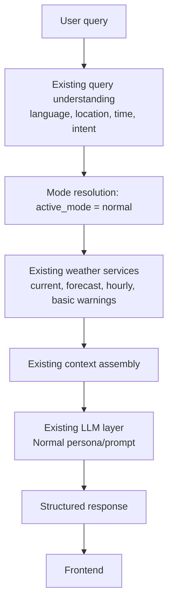
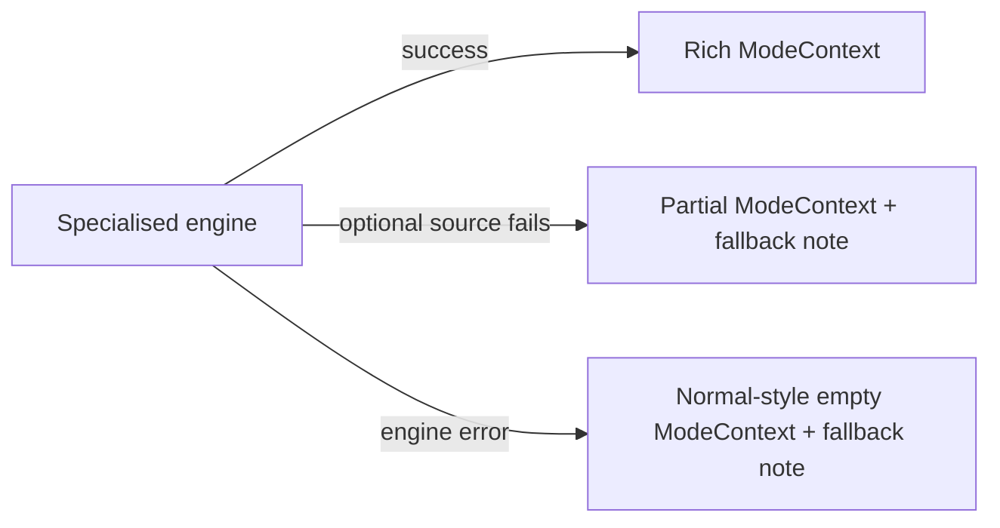

# 03 — Normal Engine

> **Document set:** `docs/mode-intelligence/`
> **Depends on:** `00_MODE_ENGINE_MASTER.md`, `01_MODE_ENGINE_ARCHITECTURE.md`, `02_MODE_ROUTING.md`
> **Scope:** The Normal Engine: the baseline / control path. Its behaviour, why it must stay stable, its relationship to the specialised engines, and the regression requirements that protect it.

---

## 0. Status Legend and Verification Notice

| Label | Meaning |
|---|---|
| **CURRENT** | Described as existing in WeatherGPT. |
| **PROPOSED** / **TARGET ARCHITECTURE** | Design not yet implemented. |
| **FUTURE / OPTIONAL** | Possible later work. |
| **[VERIFY]** | Must be confirmed against the repository. |
| **[CAPTURE]** | Real observed behaviour must be recorded here by the implementer. |

> **Notice.** This document was written without reading the repository. Statements about the existing Normal flow are *reported*, not *observed*. Section 12 lists what to confirm. The Normal Engine is the most safety-critical part of this design precisely because it is meant to change **nothing**.

---

## 1. Purpose

Normal Mode is the **baseline WeatherGPT experience**. When the Mode Engine layer is introduced, Normal Mode is the **control**: the path against which every specialised engine, and the layer itself, is judged.

The Normal Engine exists so that:

1. the engine architecture is **uniform** (every mode resolves to an engine, including Normal),
2. Normal stays **exactly as it behaves today**,
3. the specialised engines have a clean reference for "what happens when no specialised processing is needed."

> **Core statement:** The Normal Engine adds no domain logic. It is the existing WeatherGPT pipeline expressed through the engine interface.

---

## 2. Baseline Behaviour (CURRENT, reported)

### 2.1 What Normal Mode handles

General weather questions, for example:

- "What is the weather today?"
- "Will it rain tomorrow?"
- "What is the temperature?"
- "Weather in Ahmedabad"
- "Forecast for Delhi"
- "How windy is it?"
- "What is the weather this week?"

The same intents in other supported languages and scripts (Gujarati, Gujlish, Hindi, Hinglish, and the other supported languages) are equally Normal Mode when they carry no specialised signal.

### 2.2 Existing Normal flow (reported)



Reported characteristics **[VERIFY each]**:

| Aspect | Reported behaviour |
|---|---|
| Understanding | Existing language, location, date/time, and weather-intent detection |
| Data | Existing weather services (current, 7-day forecast, hourly, location search) |
| Warnings | Basic warnings as in the existing pipeline |
| LLM | Same LLM, Normal persona/prompt |
| Response | Existing structured response |
| Extra domain processing | None |

**[CAPTURE]** the actual Normal path in the code: which function assembles context, which prompt is used, which response fields are populated.

---

## 3. Why Normal Must Remain Stable

1. **It is the control.** Without an unchanged baseline, a regression in a specialised engine cannot be told apart from a regression in the shared pipeline.
2. **It carries the most traffic.** General weather questions are the majority use case; any regression is widely felt.
3. **It is the fallback destination.** When a specialised engine fails or routing is uncertain, the system falls back to Normal-style behaviour (see `09`). A broken Normal path removes the safety net.
4. **It protects existing users and tests.** The project already has multiple sprints of tests and behaviour built around the current Normal experience.
5. **Cost and latency.** Normal queries should stay fast and cheap: no extra external calls, no extra prompt weight.

> **Rule:** Existing normal weather queries must behave as before **unless there is a documented, reviewed reason to change them.** Any deliberate change is recorded in this document under Section 11 and covered by updated tests.

---

## 4. Normal Engine Definition (PROPOSED)

### 4.1 Responsibilities

The Normal Engine **must**:

- accept `request` and `base_context` through the standard engine interface,
- return a `ModeContext` with `mode = "normal"`,
- leave `base_context` untouched,
- add **no** domain data, insights, or recommendations,
- add **no** external calls beyond what the existing Normal path already makes,
- record minimal metadata (mode, engine version, duration),
- never raise.

The Normal Engine **must not**:

- run Farmer, Traveller, or Researcher logic,
- call `agromet_service`, GFS/model comparison, or historical/climate services **unless the existing Normal path already does so**,
- perform its own mode detection or attempt to "upgrade" the query to a specialised mode (that is routing's job, `02`),
- change wording, structure, or content of the response relative to today,
- add fields to the response that alter existing rendering.

### 4.2 Conceptual implementation

```python
# PROPOSED: conceptual sketch, adapt to repository conventions
class NormalEngine(BaseModeEngine):
    mode = "normal"

    async def process(self, request, base_context) -> "ModeContext":
        # Pass-through. No plan/select/retrieve/combine/reason work.
        ctx = ModeContext.empty(mode="normal", version=self.engine_version)
        ctx.metadata.passthrough = True
        return ctx
```

Notes:

- It intentionally **overrides `process()`** rather than filling in the five steps, because there is nothing to plan, select, retrieve, combine, or reason about.
- The returned context is **empty of domain content**. The fusion step then produces exactly the input the LLM receives today.
- Because the engine is trivial, it adds negligible latency.

### 4.3 What "empty" means for fusion

For Normal, the fused context handed to the LLM must be **equivalent to the current context** for the same request:

| Fusion input | Normal value |
|---|---|
| `base_context` | Same as today |
| `mode_context` | Empty (no `domain_data`, `insights`, `recommendations`); no extra prompt block |
| Source metadata | Same as today; no additional attribution items |
| User request | Same as today |

The serialiser that turns `mode_context` into a prompt block **must emit nothing** for an empty Normal context, so the prompt text is unchanged. **[VERIFY at implementation: compare the assembled prompt before and after.]**

### 4.4 Bypass option (PROPOSED, recommended)

Because Normal is a pass-through, the safest integration is that the orchestration layer can skip the engine call for Normal or use a configuration flag to route everything through the legacy path (see `01`, Section 14.3). Either approach must produce **identical** output. The uniform-engine approach is preferred for consistency; the bypass is a safety valve. Decide and record in `11`.

---

## 5. Relationship with the Specialised Engines

### 5.1 Comparison

| | Normal | Farmer | Traveller | Researcher |
|---|---|---|---|---|
| Extra data | None | Agromet, crop context | Hourly/exposure/packing inputs | History, climate, GFS |
| Domain rules | None | Agricultural | Travel | Analytical |
| Output `ModeContext` | Empty | Rich | Rich | Rich |
| Failure impact | Existing error handling | Falls back to Normal-style | Falls back to Normal-style | Falls back to Normal-style |
| Role | Baseline / control | Specialist | Specialist | Specialist |

### 5.2 Normal as the fallback target

When a specialised engine cannot do its job, the degraded result should look like **what Normal would have produced**, plus a fallback note explaining what was unavailable (`09`). The specialised engines therefore depend **conceptually** on Normal behaviour staying intact.



### 5.3 What Normal does not do for specialised queries

Normal does **not** try to answer a crop, travel, or research question with specialised depth. If the user asks such a question while in Normal:

- **Routing** decides whether to move to a specialised mode (`02`). If it does not, the query is answered as a plain weather question.
- The Normal Engine never inspects the query for domain content. It cannot "quietly" become a specialist.

This keeps a clean division: **routing chooses; engines execute.**

### 5.4 Shared base context

The specialised engines build **on top of** the same base context Normal uses. If Normal's base context changes, all engines are affected. Base-context changes therefore count as changes to the baseline and must be regression-tested against Normal first.

---

## 6. Normal-Mode Query Handling Details

### 6.1 Time and location

Normal uses the existing time and location understanding unchanged.

- Temporal-only queries ("Will it rain tomorrow?", "what is forecast for next three hours", "How windy will it be tonight?", "What about next 24 hours?", "what is the weather today") must not be interpreted as locations.
- "Is it a good time to travel to Delhi right now?" is a routing case (Traveller signal). If it still reaches Normal, the location must be `Delhi`, never `travel to Delhi`.

These behaviours belong to query understanding, not the Normal Engine, and the Normal regression suite must keep asserting them.

### 6.2 Multilingual

Normal must behave identically for every supported language and script, for example:

| Query | Language |
|---|---|
| "What is the weather in Ahmedabad?" | English |
| "કાલે વરસાદ પડશે?" | Gujarati Unicode |
| "kale varsad padse?" | Gujlish |
| "kale bapore tapman su che" | Gujlish |
| "कल बारिश होगी?" | Hindi Unicode |
| "mujhe kal ka mausam batao" | Hinglish |

The engine passes language and script metadata through and never forces English.

### 6.3 GIS and voice

- GIS location context reaches Normal via base context as it does today. The engine does not add GIS logic.
- `/voice/chat` transcripts follow the same path, so Normal handles them identically.

### 6.4 Guests and authenticated users

Normal behaviour is identical for guests and authenticated users. No mode state is stored on the engine.

---

## 7. Failure Handling

Because the Normal Engine performs no retrieval, it has almost no failure surface of its own.

| Failure | Behaviour |
|---|---|
| Engine raises unexpectedly | Base wrapper catches it, returns an empty context, logs; chat continues |
| Weather service fails | Handled by the **existing** pipeline error handling, unchanged |
| Location cannot be resolved | Existing behaviour (for example asking for a location), unchanged |
| Warning data unavailable | Existing behaviour, unchanged |

The Normal Engine introduces **no new failure modes**. Any test that shows a new failure mode for Normal is a regression.

---

## 8. Attribution and Honesty

- Normal uses whatever attribution the existing pipeline provides. It adds none and removes none.
- It must not present AI text as official information, exactly as before.
- Because it adds no specialised claims, the risk of a fabricated advisory from the engine layer is nil by design.

---

## 9. Performance

Normal must not become slower or more expensive:

- **No new external API calls.**
- **No added prompt tokens** (the LLM completion limit is small; unnecessary context is a cost).
- Engine overhead is a function call and an empty object. Record the measured difference during testing; it should be negligible. **[VERIFY with a before/after timing comparison.]**
- Existing caching (including the performance cache) continues to apply.

---

## 10. Regression Requirements (mandatory)

Normal-mode regression testing is **mandatory** for every change in this project. This is the highest-priority test area (`11`).

### 10.1 Establish the baseline before changing anything

Do this **first**, on the current code, before adding any engine code:

1. Record the commit hash of the baseline (for example the current tip of `phase4-intelligent-modes`; the reported `e942551` is a merge point, confirm the actual state).
2. Run the full existing test suite and record results, including `test_agromet_service.py`, `test_daily_outlook_e2e.py`, `test_live_e2e.py`, `test_mode_boundaries_e2e.py`, `test_multilingual_gujlish.py`, `test_production_security.py`, `test_sprint22.py`, and the sprint-specific tests.
3. Build a **characterisation set** of Normal queries and store the current outputs (Section 10.2).

### 10.2 Characterisation ("golden") set

Capture, for a fixed list of Normal queries across languages, the **deterministic parts** of the pipeline output:

| Capture | Why it is comparable |
|---|---|
| Parsed request (language, script, location, time, intent) | Deterministic |
| `ModeResolution` (`selected_mode`, `active_mode`, `display_mode`) | Deterministic |
| `base_context` content | Deterministic given mocked weather data |
| Assembled LLM prompt/context text | Deterministic given mocked inputs |
| Structured response fields other than free-form LLM text | Deterministic |
| Which services were called, and how many times | Deterministic |

**Do not compare raw LLM free text for equality.** LLM output varies between runs. Compare everything **up to the LLM boundary**, and for the final answer use structural checks (for example: contains location, contains temperature units, correct language, no specialised sections).

Use **mocked/recorded weather and LLM responses** so the comparison is deterministic and does not depend on live APIs. Live end-to-end tests (`test_live_e2e.py`) remain as an additional smoke layer.

### 10.3 Normal regression matrix

| # | Area | Check |
|---|---|---|
| N1 | Plain current weather query | Output identical to baseline (up to the LLM boundary) |
| N2 | Forecast query (tomorrow, this week) | Identical |
| N3 | Hourly / "next three hours" / "next 24 hours" | Identical; temporal phrases not treated as locations |
| N4 | Location-named queries ("Weather in Ahmedabad", "Forecast for Delhi") | Identical |
| N5 | Wind / temperature / rain single-intent queries | Identical |
| N6 | English, Gujarati, Gujlish, Hindi, Hinglish, and at least one further script | Identical |
| N7 | Voice transcript through `/voice/chat` | Identical |
| N8 | GIS-context requests | Identical |
| N9 | Guest and authenticated | Identical |
| N10 | Prompt text for Normal | Byte-for-byte identical to baseline, with no extra mode block |
| N11 | External call count for Normal | Not greater than baseline |
| N12 | Latency | Within an agreed tolerance of baseline |
| N13 | Weather-service failure | Same error behaviour as baseline |
| N14 | Existing tests | All pass with no modification to expected values |

### 10.4 Rules for changing Normal on purpose

If a deliberate change to Normal is ever justified:

1. Document the reason in Section 11 of this file.
2. Update the characterisation set in the same change, with review.
3. Never change expected values in existing tests **to make them pass** without a written reason.

---

## 11. Documented Changes to Normal Behaviour

None planned. This section is the single place any intended change to Normal is recorded.

| # | Date | Change | Reason | Tests updated | Approved by |
|---|---|---|---|---|---|
| | | | | | |

---

## 12. Repository Capture Checklist

- [ ] The actual Normal code path from `/chat` to the response, with function names and files.
- [ ] Exact contents and shape of `base_context` for a Normal request.
- [ ] Where the Normal persona/prompt is defined and how it is selected.
- [ ] What the Normal response contains today, field by field.
- [ ] Whether Normal currently calls any service beyond current/forecast/hourly/warnings.
- [ ] Whether any specialised logic is currently reachable from Normal (for example auto-routing hooks).
- [ ] Which existing tests define "normal behaviour" and which are Normal-specific.
- [ ] Baseline commit hash and full baseline test results.
- [ ] Whether a bypass/flag mechanism is already present.
- [ ] Measured baseline latency and external-call counts for representative Normal queries.

Record mismatches:

| # | Item | Document said | Repository actually has | Action |
|---|---|---|---|---|
| 1 | | | | |

---

## 13. Implementation Notes

1. **Implement Normal first.** Build `BaseModeEngine`, the registry, and `NormalEngine`, wire them into the chat flow, and prove N1 to N14 pass **before writing any specialised engine** (see `11`).
2. **Keep the diff small.** Introducing the engine call for Normal should be a minimal change in the orchestration layer.
3. **Leave prompts alone.** Do not restructure the Normal persona/prompt as part of introducing the engine.
4. **Do not "improve" Normal on the way through.** Enhancements to Normal are separate, documented changes.
5. **Fail closed to Normal.** Wherever another component needs a safe default, it should use the Normal path.

---

## 14. Summary

- The Normal Engine is the **baseline/control**: a pass-through that returns an empty `ModeContext` and changes nothing.
- It adds **no** domain logic, **no** external calls, and **no** prompt weight.
- Routing decides when a query leaves Normal; Normal never upgrades itself.
- Specialised engines fall back **to Normal-style behaviour**, so Normal stability underpins the whole design.
- **Regression testing against a pre-change baseline is mandatory**, comparing everything up to the LLM boundary with mocked data, not raw LLM text.
- Anything marked **[VERIFY]** or **[CAPTURE]** must be reconciled with the repository, which is the source of truth.